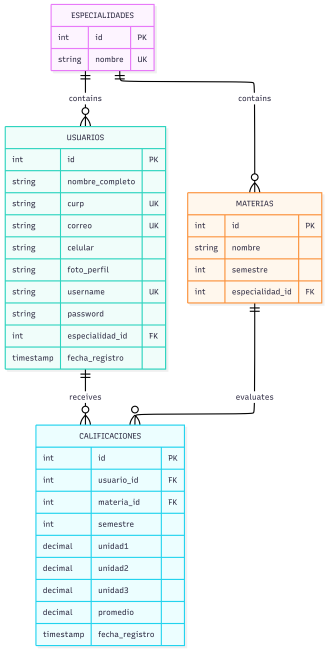

# 📚 Sistema de Gestión de Calificaciones


## 📖 Descripción

Sistema de escritorio para control escolar desarrollado en **Python** con **Flet Framework** y **MySQL**. Permite a los alumnos:

- ✅ Registrarse e iniciar sesión de forma segura
- ✅ Gestionar calificaciones por materia y semestre
- ✅ Visualizar promedios por materia y general acumulado
- ✅ Administrar materias (agregar/eliminar)
- ✅ Editar perfil personal y cambiar contraseña
- ✅ Historial académico completo (1° a 6° semestre)

## 🎯 Objetivo

Proporcionar una herramienta intuitiva y eficiente para que los estudiantes de bachillerato tecnológico lleven un control detallado de su rendimiento académico a lo largo de toda su carrera.

## 🛠️ Tecnologías Utilizadas

| Tecnología | Versión | Propósito |
|------------|---------|-----------|
| Python | 3.10+ | Lenguaje base |
| Flet | 0.21.2 | Interfaz gráfica |
| MySQL | 5.7+ | Base de datos |
| bcrypt | 5.0+ | Encriptación |
| Pillow | 12.0+ | Manejo de imágenes |

## 📋 Requisitos Previos

- Python 3.10 o superior
- MySQL Server 5.7 o superior
- pip o uv (gestor de paquetes)

## 🚀 Instalación

### 1. Clonar el repositorio

```bash
git clone https://github.com/tu-usuario/trabajo-final.git
cd trabajo-final
```

### 2. Crear y activar el entorno virtual

```bash
python -m venv .venv
.venv\Scripts\activate

# Linux/macOS
python -m venv .venv
source .venv/bin/activate
```
### 3. instalar dependencias

```bash
con pip es:
pip install flet==0.21.2 mysql-connector-python bcrypt pillow
```

```bash
con uv es:
uv pip install flet==0.21.2 mysql-connector-python bcrypt pillow
```

### 4. configuracion de base de datos
```bash
# Acceder a MySQL
mysql -u root -p

# Ejecutar script (dentro de MySQL)
SOURCE database/sistema_calificaciones.sql;
```

### 5. configurar conexion

```python
self._connection = mysql.connector.connect(
    host='localhost',
    user='root',
    password='tu_contraseña',
    database='sistema_calificaciones'
)
```

### 6. ejecutar aplicacion
```bash
cd src
python main.py
```

### 7. estuctrura del proyecto

```bash
trabajo-final/
├── src/
│   ├── main.py                 # Punto de entrada
│   ├── controllers/            # Lógica de control
│   │   ├── app_controller.py
│   │   ├── auth_controller.py
│   │   ├── grade_controller.py
│   │   └── profile_controller.py
│   ├── views/                  # Interfaz de usuario
│   │   ├── login_view.py
│   │   ├── register_view.py
│   │   ├── dashboard_view.py
│   │   └── profile_view.py
│   ├── models/                 # Base de datos
│   │   ├── database.py
│   │   ├── user_model.py
│   │   ├── subject_model.py
│   │   └── grade_model.py
│   └── utils/                  # Utilidades
│       └── validators.py
├── database/
│   └── sistema_calificaciones.sql
└── README.md
```

## 🖥️ Funcionalidades

### 🔐 Login y Registro

- Inicio de sesión con usuario y contraseña

- Registro con validación de CURP, email y contraseña

- Encriptación de contraseñas con SHA256

### 📊 Dashboard

-Vista general del alumno y su especialidad

-Selector de semestre (1° a 6°)

-Lista de materias con campos para calificaciones

-Promedio por materia, semestre y general

### 📝 Gestión de Calificaciones

-Registro de 3 unidades por materia

-Validación de rango (0-10)

-Cálculo automático de promedios

-Indicador visual aprobado/reprobado

### ➕ Gestión de Materias

-Agregar nuevas materias

-Eliminar materias existentes

-Materias asociadas a especialidad y semestre

### 👤 Perfil de Usuario

-Ver datos personales

-Editar información

-Cambiar contraseña

## 🔧 Validaciones Implementadas

| Tipo | Validación | Mensaje |
|------|------------|---------|
| Login | Campos vacíos | "Todos los campos son obligatorios" |
| Login | Credenciales incorrectas | "Usuario o contraseña incorrectos" |
| Registro | CURP inválida | "CURP no válida" |
| Registro | Email inválido | "Correo electrónico no válido" |
| Registro | Contraseñas no coinciden | "Las contraseñas no coinciden" |
| Registro | Contraseña corta | "Mínimo 6 caracteres" |
| Calificaciones | Fuera de rango | "Notas entre 0 y 10" |
| Calificaciones | Número inválido | "Ingrese números válidos" |


## 📊 Diagrama Entidad-Relación (DER)


